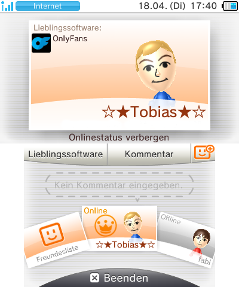

# Dummy Favorite Application
## Why?
It is quite funny to see images like this:



I have not yet tested if this exact setup works with actual streetpasses, but as it is possible with the Homebrew Launcher, I am positive that this also should show app when you StreetPass someone with this.

## Requirements
- homebrewed 3DS to install `.cia` applications
- [devkitARM](https://devkitpro.org/wiki/Getting_Started)
- [`makerom`](https://github.com/3DSGuy/Project_CTR/releases/tag/makerom-v0.18.3)
- [`bannertool`](https://github.com/Steveice10/bannertool/releases/tag/1.2.0)
- `make`
## Building
1. Modify the contents of the Metadata in the [`Makefile`](Makefile)
``` make
APP_TITLE   := OnlyFans
APP_DESCRIPTION := OnlyFans
APP_AUTHOR := memeToasty
```
2. Change the [`icon.png`](meta/icon.png) to an image that you want
> **Warning**
> make sure that the image is 48x48 pixels large

3. Modify the contents  [`rominfo.rsf`](meta/rominfo.rsf)
``` make
BasicInfo:
  Title              : "OnlyFans"
  ProductCode        : "CTR-H-ONFA"

...

  UniqueId           : 0x1dfd
```
> **Warning**
> If you want 2 of those dummy on your system at the same time, change the `UniqueId` field to something higher

4. Run `make` in a terminal
5. Install the generated `.cia` file on your 3DS
6. Run the application that was added to your home screen (This is necessary so that the app gets added to the list of favoritable applications)
7. It does not do anything, so just press START or HOME to leave it
8. Go to friend list and set the favorite game
9. Profit?
